# INDEX

[1. INITIAL STEPS](#1-initial-steps)   
- [1.1 Using physical device for tests](#11-using-physical-device-for-tests) //
[1.2 Using Cellphone emulator for tests](#12-using-cellphone-emulator-for-tests) //
  [1.3 Project creation](#13-project-creation) //

[2. WORKING IN THE PROJECT](#2-working-in-the-project) 
- [2.1 Loading page](#21-loading-page) //
[2.2 Loading page animation](#22-loading-page-animation)
[2.3 Loading page duration](#23-loading-page-duration)
[2.4 Run the app](#24-run-the-app)

---
---

## 1. INITIAL STEPS
[Index](#index)

**Alias used**

In this project I'll use these alias:  
`git config --global alias.s "status --short"`  
`git config --global alias.lg "log --graph --abbrev-commit --decorate --format=format:'%C(bold blue)%h%C(reset) - %C(bold green)(%ar)%C(reset) %C(white)%s%C(reset) %C(dim white)- %an%C(reset)%C(bold yellow)%d%C(reset)' --all"`

**Repo creation**  

GitHub -> New repo -> name: Android1 -> Public -> README.md -> License: GNU GPL v3.0

Local: folder: pry-android1 -> Git Bash:  
`git init`  
`git remote add origin [URL]`  
`git pull origin master`  

**'develop' branch creation**

GitHub -> create branch 'develop'  
Local -> branch master -> create folder 'images', add some screenshots  

`git branch --all`
~~~
* master
  remotes/origin/master
~~~

`git fetch`
~~~
From https://github.com/freddy-alexis-ht/Android1
 * [new branch]      develop    -> origin/develop
~~~

`git branch --all`
~~~
* master
  remotes/origin/develop
  remotes/origin/master
~~~

`git checkout -b develop`
~~~
Switched to a new branch 'develop'
~~~

`git branch --all`
~~~
* develop
  master
  remotes/origin/develop
  remotes/origin/master
~~~

`git s`  
`git add .`  
`git commit -m "Creating folder 'images'"`  
`git push`  
`git push --set-upstream origin develop`  

`git lg`
~~~
* f57a167 - (18 minutes ago) Creating folder 'images' - Freddy2 (HEAD -> develop, origin/develop)
* dd5e694 - (6 hours ago) Initial commit - freddy-alexis-ht (origin/master, master)
~~~

**App to build**  

Install this app in the mobile device:  
<https://play.google.com/store/apps/details?id=com.redsystem.fondodepantalla>  

**Project materials**  

**Android Studio installation**  

<https://developer.android.com/studio?hl=es-419&gclid=Cj0KCQiAweaNBhDEARIsAJ5hwbe7BMOdV5iZqG1E0eV6vit47rEIkAtdhh1GyJyfVijahrSVqzrKBngaApXvEALw_wcB&gclsrc=aw.ds>  

Download -> Install -> Check: Android Virtual Device.

---

### 1.1 Using physical device for tests
[Index](#index)

Vysor is useful to virtualize our device's screen in our PC. Another app is 'MirrorGo' (Wondershare).  
Whatever app we use, we still have to enable 'USB Debugging' (Depuración USB), and connect the device to the laptop.  

**Vysor installation and Cellphone configuration**

Laptop
- Search for: Vysor -> Download -> Windows -> Install -> Open Vysor.

Cellphone 
- PlayStore -> Vysor -> Install.  
- Plug the cellphone to the laptop.
- Cellphone -> Configuration -> About -> Open 'Developer mode' -> Enable 'Depuracion USB' -> Message: "Vysor connected".

Laptop
- Vysor detects our device.

Android Studio
- New project -> empty activity -> random names for the project.
- It should recognize our device in the IDE interface.

>In case Android Studio doesn't recognize our cellphone:
>- Install Google USB Driver in the IDE: File -> Settings -> Android SDK -> SDK tools -> Google USB Driver
>- In case the problem persists, go here.
>  - [Google USB driver page](https://developer.android.com/studio/run/win-usb)
>  - [USB driver from Original Equipment Manufacturer (OEM)](https://developer.android.com/studio/run/oem-usb#Drivers)

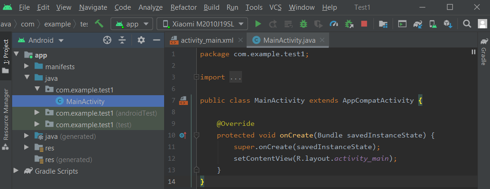

Laptop
- When clicking on 'play' icon in Vysor interface, our cellphone screen should appear in the laptop, in real-time.
- It said it requires extra configuration in the cellphone:

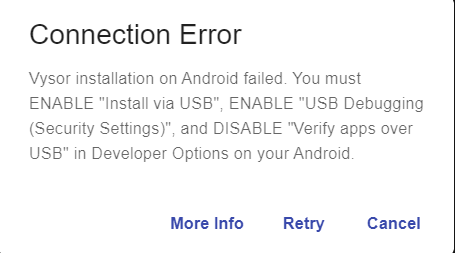
  
**Running the app in Android Studio**

After correctly configuring the cellphone, run the app.  
A message will appear in the cellphone with a countdown from 10 to 0. It requires permission to install the app.  

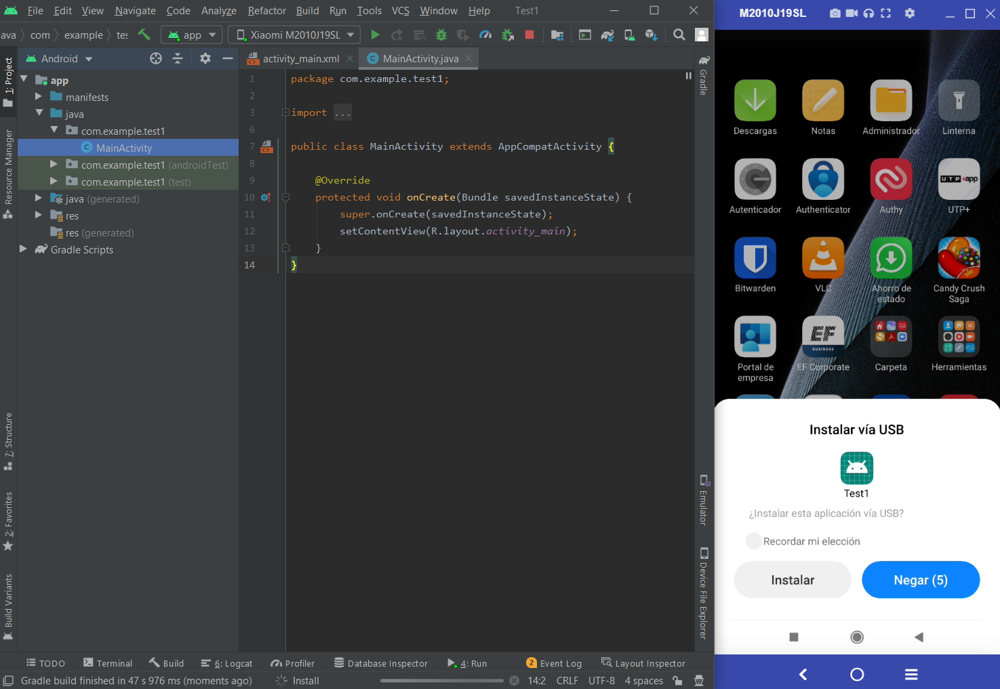

If time finishes:

If 'Retry' is clicked:

---

### 1.2 Using Cellphone emulator for tests
[Index](#index)

Android Studio  
- In the same previous Android Studio project, or ..
- New project -> empty activity -> random names for the project.
- Click in 'AVD Manager' icon. 

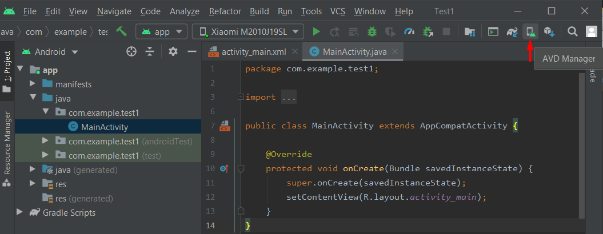

- Create virtual device:
	- Devices that have the 'PlayStore' logo mean that they can access to Google services like: start session with a Google account, access to PlayStore, ...
	- Click in 'Pixel 4' (it has the PlayStore logo) -> Next
- It shows API Levels:

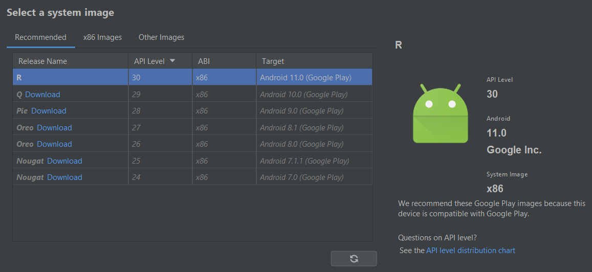

- Select 'R' (download if necessary) -> Next -> AVD Name: Pixel 4 API 30 (default) -> Finish

To start the emulator, click in the 'play' icon (it might take a few minutes).

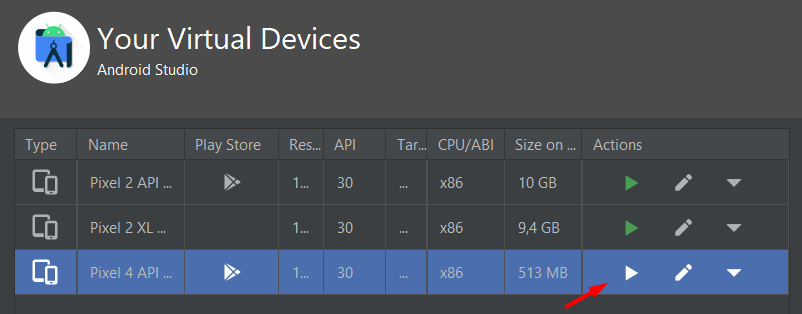

It'll start the setup -> Click in finish setup -> Start -> Don't copy -> valid email and password -> Next -> 2-Step verification -> Cell message -> More -> Accept.  

To run the app, the options in red should be selected. Then, click in Play.

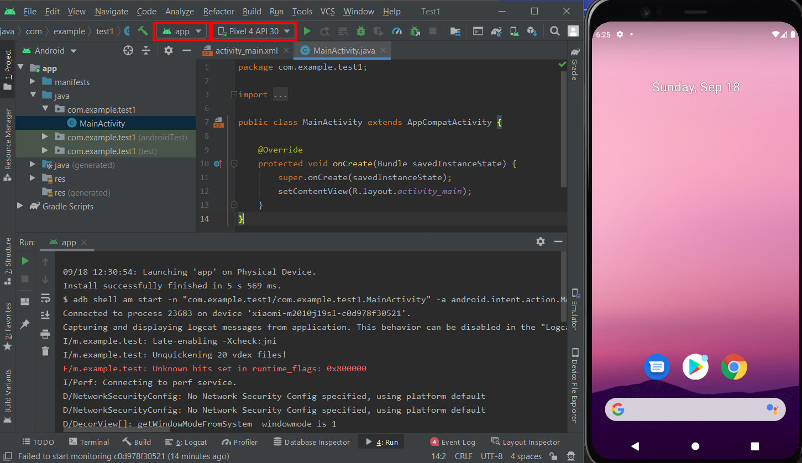

App running in the emulator.

---

### 1.3 Project creation
[Index](#index)

The project will be created in: D:\01-EVE\CURSOS\19-Android1\pry-android1 .. because we already have it as a local-repo, linked to the remote-repo. 

- Android Studio -> New project -> empty activity
	- Name: Wallpapers
	- Package name: com.sunday.wallpapers
	- Save location: D:\01-EVE\CURSOS\19-Android1\pry-android1
	- Language: Java
	- Minimum SDK: API 21: Android 5.0 (Lollipop)

Note:
- Having installed 'Markdown' plugin in Android Studio, the preview-for-Markdown doesn't appear.
- According to [this](https://stackoverflow.com/questions/69171807/markdown-editor-and-preview-not-working-in-android-studio), it's a problem about IDE version. 

There is a solution, but I can't apply it. The option indicated in that link doesn't appear to me. So, I'm updating IDE version.

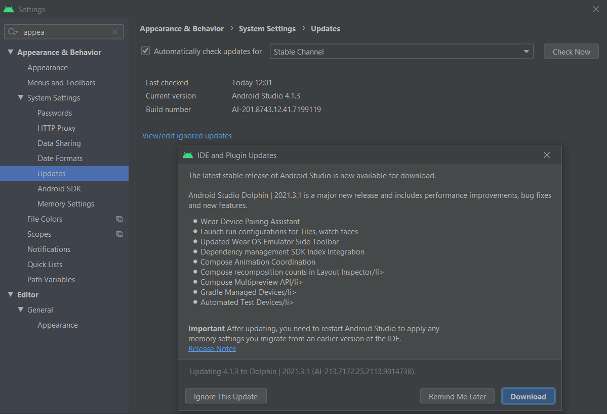

Now, it does appear:
- Help -> Find Action -> type: Choose Boot Java Runtime for the IDE: -> Enter.
- Select a runtime with JCEF (Java Chromium Embedded Framework) in its title (like the default) -> Ok.

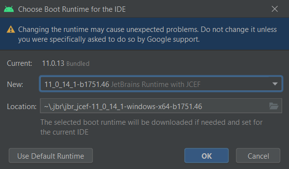

- Reboot, now the Markdown preview appears.

---
---

## 2. WORKING IN THE PROJECT
[Index](#index)

### 2.1 Loading page

Used resources:
- Flaticon: <https://www.flaticon.es/>

This is the way the project starts:

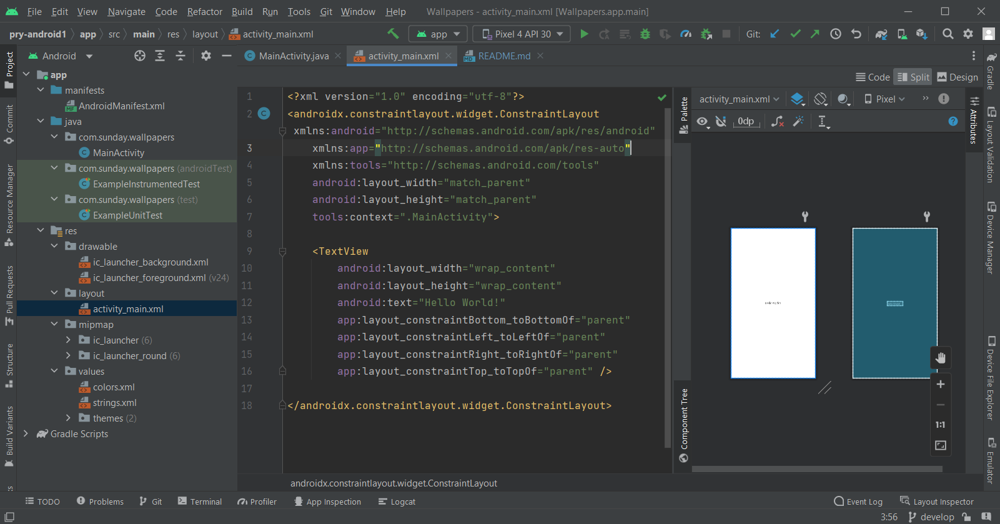

**File: activity_main.xml**

Replace the layout-type from:  
`<androidx.constraintlayout.widget.ConstraintLayout ...`  
..to:  
`<RelativeLayout>`  

`LinearLayoutCompat` configuration will apply to all views inside it.  

~~~
<?xml version="1.0" encoding="utf-8"?>
<!--background="#fff": white-->
<RelativeLayout
    xmlns:android="http://schemas.android.com/apk/res/android"
    xmlns:app="http://schemas.android.com/apk/res-auto"
    xmlns:tools="http://schemas.android.com/tools"
    android:layout_width="match_parent"
    android:layout_height="match_parent"
    android:background="#fff"
    tools:context=".MainActivity">

    <!-- match_parent: same size as the parent -->
    <!-- gravity=center: views added will be centered -->
    <androidx.appcompat.widget.LinearLayoutCompat
        android:layout_width="match_parent"
        android:layout_height="match_parent"
        android:orientation="vertical"
        android:gravity="center">
    </androidx.appcompat.widget.LinearLayoutCompat>

</RelativeLayout>
~~~

**Loading icon**

Icons can be found here:  
- Flaticon: <https://www.flaticon.es/>

Project materials are given with the course, I'll use them as I need them.  
- To avoid problems, the image name should have only letters, not numbers.
- Copy file: carga.png
- Folder: res:drawable -> right click -> Open in explorer -> paste the image

**File: activity_main.xml**

Inside 'LinearLayoutCompat': 
- Add a view for the image.
- Add a view for the text.

To be organized, for the text go to:
- File: res:drawable:strings.xml
~~~
<resources>
    <string name="app_name">Wallpapers</string>
    <string name="developer">Developed by: Freddy Huaman</string>
</resources>
~~~  

- This is 'activity_main.xml'

~~~
<?xml version="1.0" encoding="utf-8"?>
<!--background="#fff": white-->
<RelativeLayout
    xmlns:android="http://schemas.android.com/apk/res/android"
    xmlns:app="http://schemas.android.com/apk/res-auto"
    xmlns:tools="http://schemas.android.com/tools"
    android:layout_width="match_parent"
    android:layout_height="match_parent"
    android:background="#fff"
    tools:context=".MainActivity">

    <!-- match_parent: same size as the parent -->
    <!-- gravity=center: views added will be centered -->
    <androidx.appcompat.widget.LinearLayoutCompat
        android:layout_width="match_parent"
        android:layout_height="match_parent"
        android:orientation="vertical"
        android:gravity="center">

        <!-- Loading image -->
        <androidx.appcompat.widget.AppCompatImageView
            android:layout_width="180dp"
            android:layout_height="180dp"
            android:src="@drawable/carga" />

        <!-- Text below the loading image -->
        <!-- wrap_content: the height depends on its content-->
        <TextView
            android:id="@+id/app_name"
            android:text="@string/app_name"
            android:textSize="20sp"
            android:textColor="#000"
            android:layout_marginTop="20sp"
            android:gravity="center"
            android:layout_width="match_parent"
            android:layout_height="wrap_content" />

        <TextView
            android:id="@+id/developer"
            android:text="@string/developer"
            android:textSize="18sp"
            android:textColor="#000"
            android:layout_marginTop="10sp"
            android:gravity="center"
            android:layout_width="match_parent"
            android:layout_height="wrap_content" />

    </androidx.appcompat.widget.LinearLayoutCompat>

</RelativeLayout>
~~~

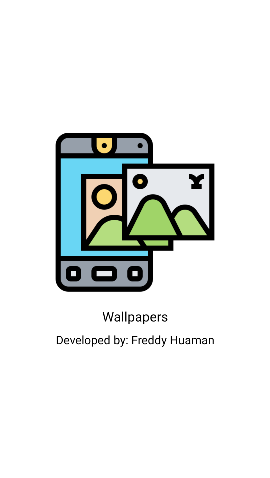

---

### 2.2 Loading page animation
[Index](#index)

Used resources:
- Lottie (animation): <https://lottiefiles.com/>

**Dependency for animation**
Go to `build.gradle` and in 'dependencies' add:  
`implementation 'com.airbnb.android:lottie:4.2.1'` -> Sync now  

We can download an animation from: <https://lottiefiles.com/>  
- Find a free one -> Download: Lottie JSON  

The course already give us one, it is in: Animaciones/carga_animacion.json

Go to the project:  
- Folder: res -> right click -> Open in explorer
- Out of 'res' -> create the folder 'assets'
- Paste the file: carga_animacion.json

**File: activity_main.xml**

~~~
	<!-- Animation -->
	<!-- assets: folder that must be created -->
	<com.airbnb.lottie.LottieAnimationView
		android:layout_width="match_parent"
		android:layout_height="100dp"
		android:layout_marginTop="10dp"
		android:layout_gravity="center"
		app:lottie_imageAssetsFolder="assets"
		app:lottie_fileName="carga_animacion.json"
		app:lottie_loop="true"
		app:lottie_autoPlay="true" />
~~~

**Names modification** 

- Change the name of 'MainActivity.java' to 'Carga.java'  
- Change the name of 'main_activity.xml.java' to 'carga.java'  

Check 'carga.xml':  
- The last line of 'RelativeLayout' changed to point to Carga.java.  
`tools:context=".Carga">`

Check 'AndroidManifest.xml':  
- It also points to Carga.java
~~~
<?xml version="1.0" encoding="utf-8"?>
<manifest xmlns:android="http://schemas.android.com/apk/res/android"
    package="com.sunday.wallpapers">

    <application
        android:allowBackup="true"
        android:icon="@mipmap/ic_launcher"
        android:label="@string/app_name"
        android:roundIcon="@mipmap/ic_launcher_round"
        android:supportsRtl="true"
        android:theme="@style/Theme.Wallpapers">
        <!-- It points to Carga.java -->
        <activity android:name=".Carga">
            <intent-filter>
                <action android:name="android.intent.action.MAIN" />

                <category android:name="android.intent.category.LAUNCHER" />
            </intent-filter>
        </activity>
    </application>

</manifest>
~~~

---

### 2.3 Loading page duration
[Index](#index)

**Carga.java**

The loading page will be there for 3 seconds, after that some code will be executed.  
Notice that Lambda-expression can be used.

~~~
package com.sunday.wallpapers;

import androidx.appcompat.app.AppCompatActivity;

import android.os.Bundle;
import android.os.Handler;

public class Carga extends AppCompatActivity {

    @Override
    protected void onCreate(Bundle savedInstanceState) {
        super.onCreate(savedInstanceState);
        setContentView(R.layout.carga);

        // loading page duration
        final int DURATION = 3000; // 3 seconds
        // executes code in a specified time
        new Handler().postDelayed(new Runnable() {
            @Override
            public void run() {
                // Code to be executed passed DURATION (3 seconds)
            }
        }, DURATION);
    }
}
~~~

Using Lambda:

~~~
public class Carga extends AppCompatActivity {

    @Override
    protected void onCreate(Bundle savedInstanceState) {
        super.onCreate(savedInstanceState);
        setContentView(R.layout.carga);

        final int DURATION = 3000; // 3 seconds

        new Handler().postDelayed(() -> {
            // Code to be executed passed DURATION (3 seconds)
        }, DURATION);
    }
}
~~~

Once the 3 seconds have finished, the loading-page should pass to other activity (view).  
- In 'com.sunday.wallpapers' (the same place where Carga.java is)
- New empty activity -> Name: MainActivity (all by default)

**Carga.java - inside run() method**

- finish(): If the return-arrow-icon is click it won't go back, it'll finish the app.  

~~~
    @Override
    protected void onCreate(Bundle savedInstanceState) {
        super.onCreate(savedInstanceState);
        setContentView(R.layout.carga);

        // loading page duration
        final int DURATION = 3000; // 3 seconds
        // executes code in a specified time
        new Handler().postDelayed(() -> {
            // Code to be executed passed DURATION (3 seconds)
            // arg-1: context: class where the call is made
            // arg-2: destiny class
            Intent intent = new Intent(Carga.this, MainActivity.class);
            startActivity(intent);
            finish();
        }, DURATION);
    }
~~~

---

### 2.4 Run the app
[Index](#index)

Run the app, it works.  
When clicking return-arrow-icon, it could be said that the activity carga.xml is destroyed.

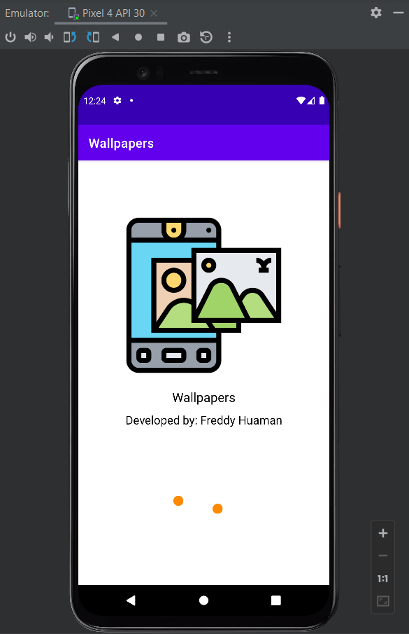

