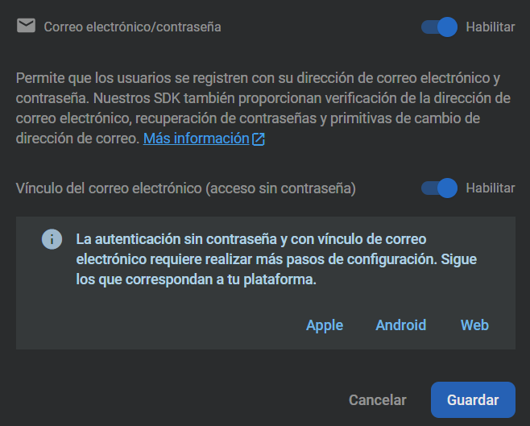

# INDEX

[1. INITIAL STEPS](#1-initial-steps)   
- [1.1 Using physical device for tests](#11-using-physical-device-for-tests) //
[1.2 Using Cellphone emulator for tests](#12-using-cellphone-emulator-for-tests) //
[1.3 Project creation](#13-project-creation) //

[2. SETTING UP THE BASE OF THE PROJECT](#2-setting-up-the-base-of-the-project) 
- [2.1 Loading page](#21-loading-page) //
[2.2 Loading page animation](#22-loading-page-animation) //
[2.3 Loading page duration](#23-loading-page-duration) //
[2.4 Run the app](#24-run-the-app) //
[2.5 Custom the loading page](#25-custom-the-loading-page) //
[2.6 Include Firebase to the project](#26-include-firebase-to-the-project) //
[2.7 App description](#27-app-description) //
[2.8 Roles: Client & Admin](#28-roles-client--admin) //

[3 DESIGN AND DEVELOP THE BASE OF THE PROJECT](#3-design-and-develop-the-base-of-the-project) 
- [3.1 Admin Activity (Part 1)](#31-admin-activity-part-1) //
[3.2 Admin Activity (Part 2)](#32-admin-activity-part-2) //
[3.3 Admin Fragments](#33-admin-fragments) //
[3.4 Client Activity](#34-client-activity) //
[3.5 Client Fragments](#35-client-fragments) //
[3.6 Page to register Administrators](#36-page-to-register-administrators) //
[3.7 Permissions configuration in Firebase](#37-permissions-configuration-in-firebase) //

---
---

## 1. INITIAL STEPS
[Index](#index)

**Alias used**

In this project I'll use these alias:  
`git config --global alias.s "status --short"`  
`git config --global alias.lg "log --graph --abbrev-commit --decorate --format=format:'%C(bold blue)%h%C(reset) - %C(bold green)(%ar)%C(reset) %C(white)%s%C(reset) %C(dim white)- %an%C(reset)%C(bold yellow)%d%C(reset)' --all"`

**Repo creation**  

GitHub -> New repo -> name: Android1 -> Public -> README.md -> License: GNU GPL v3.0

Local: folder: pry-android1 -> Git Bash:  
`git init`  
`git remote add origin [URL]`  
`git pull origin master`  

**'develop' branch creation**

GitHub -> create branch 'develop'  
Local -> branch master -> create folder 'images', add some screenshots  

`git branch --all`
~~~
* master
  remotes/origin/master
~~~

`git fetch`
~~~
From https://github.com/freddy-alexis-ht/Android1
 * [new branch]      develop    -> origin/develop
~~~

`git branch --all`
~~~
* master
  remotes/origin/develop
  remotes/origin/master
~~~

`git checkout -b develop`
~~~
Switched to a new branch 'develop'
~~~

`git branch --all`
~~~
* develop
  master
  remotes/origin/develop
  remotes/origin/master
~~~

`git s`  
`git add .`  
`git commit -m "Creating folder 'images'"`  
`git push`  
`git push --set-upstream origin develop`  

`git lg`
~~~
* f57a167 - (18 minutes ago) Creating folder 'images' - Freddy2 (HEAD -> develop, origin/develop)
* dd5e694 - (6 hours ago) Initial commit - freddy-alexis-ht (origin/master, master)
~~~

**App to build**  

Install this app in the mobile device:  
<https://play.google.com/store/apps/details?id=com.redsystem.fondodepantalla>  

**Project materials**  

**Android Studio installation**  

<https://developer.android.com/studio?hl=es-419&gclid=Cj0KCQiAweaNBhDEARIsAJ5hwbe7BMOdV5iZqG1E0eV6vit47rEIkAtdhh1GyJyfVijahrSVqzrKBngaApXvEALw_wcB&gclsrc=aw.ds>  

Download -> Install -> Check: Android Virtual Device.

---

### 1.1 Using physical device for tests
[Index](#index)

Vysor is useful to virtualize our device's screen in our PC. Another app is 'MirrorGo' (Wondershare).  
Whatever app we use, we still have to enable 'USB Debugging' (Depuración USB), and connect the device to the laptop.  

**Vysor installation and Cellphone configuration**

Laptop
- Search for: Vysor -> Download -> Windows -> Install -> Open Vysor.

Cellphone 
- PlayStore -> Vysor -> Install.  
- Plug the cellphone to the laptop.
- Cellphone -> Configuration -> About -> Open 'Developer mode' -> Enable 'Depuracion USB' -> Message: "Vysor connected".

Laptop
- Vysor detects our device.

Android Studio
- New project -> empty activity -> random names for the project.
- It should recognize our device in the IDE interface.

>In case Android Studio doesn't recognize our cellphone:
>- Install Google USB Driver in the IDE: File -> Settings -> Android SDK -> SDK tools -> Google USB Driver
>- In case the problem persists, go here.
>  - [Google USB driver page](https://developer.android.com/studio/run/win-usb)
>  - [USB driver from Original Equipment Manufacturer (OEM)](https://developer.android.com/studio/run/oem-usb#Drivers)

Laptop
- When clicking on 'play' icon in Vysor interface, our cellphone screen should appear in the laptop, in real-time.
- It said it requires extra configuration in the cellphone:

  
**Running the app in Android Studio**

After correctly configuring the cellphone, run the app.  
A message will appear in the cellphone with a countdown from 10 to 0. It requires permission to install the app.  

If time finishes:

If 'Retry' is clicked:

---

### 1.2 Using Cellphone emulator for tests
[Index](#index)

Android Studio  
- In the same previous Android Studio project, or ..
- New project -> empty activity -> random names for the project.
- Click in 'AVD Manager' icon. 

- Create virtual device:
	- Devices that have the 'PlayStore' logo mean that they can access to Google services like: start session with a Google account, access to PlayStore, ...
	- Click in 'Pixel 4' (it has the PlayStore logo) -> Next
- It shows API Levels:

- Select 'R' (download if necessary) -> Next -> AVD Name: Pixel 4 API 30 (default) -> Finish

To start the emulator, click in the 'play' icon (it might take a few minutes).

It'll start the setup -> Click in finish setup -> Start -> Don't copy -> valid email and password -> Next -> 2-Step verification -> Cell message -> More -> Accept.  

To run the app, the options in red should be selected. Then, click in Play.

App running in the emulator.

---

### 1.3 Project creation
[Index](#index)

The project will be created in: D:\01-EVE\CURSOS\19-Android1\pry-android1 .. because we already have it as a local-repo, linked to the remote-repo. 

- Android Studio -> New project -> empty activity
	- Name: Wallpapers
	- Package name: com.sunday.wallpapers
	- Save location: D:\01-EVE\CURSOS\19-Android1\pry-android1
	- Language: Java
	- Minimum SDK: API 21: Android 5.0 (Lollipop)

Note:
- Having installed 'Markdown' plugin in Android Studio, the preview-for-Markdown doesn't appear.
- According to [this](https://stackoverflow.com/questions/69171807/markdown-editor-and-preview-not-working-in-android-studio), it's a problem about IDE version. 

There is a solution, but I can't apply it. The option indicated in that link doesn't appear to me. So, I'm updating IDE version.

Now, it does appear:
- Help -> Find Action -> type: Choose Boot Java Runtime for the IDE: -> Enter.
- Select a runtime with JCEF (Java Chromium Embedded Framework) in its title (like the default) -> Ok.

- Reboot, now the Markdown preview appears.

---
---

## 2. SETTING UP THE BASE OF THE PROJECT
[Index](#index)

### 2.1 Loading page

Used resources:
- Flaticon: <https://www.flaticon.es/>

This is the way the project starts:

**File: activity_main.xml**

Replace the layout-type from:  
`<androidx.constraintlayout.widget.ConstraintLayout ...`  
..to:  
`<RelativeLayout>`  

`LinearLayoutCompat` configuration will apply to all views inside it.  

~~~
<?xml version="1.0" encoding="utf-8"?>
<!--background="#fff": white-->
<RelativeLayout
    xmlns:android="http://schemas.android.com/apk/res/android"
    xmlns:app="http://schemas.android.com/apk/res-auto"
    xmlns:tools="http://schemas.android.com/tools"
    android:layout_width="match_parent"
    android:layout_height="match_parent"
    android:background="#fff"
    tools:context=".MainActivity">

    <!-- match_parent: same size as the parent -->
    <!-- gravity=center: views added will be centered -->
    <androidx.appcompat.widget.LinearLayoutCompat
        android:layout_width="match_parent"
        android:layout_height="match_parent"
        android:orientation="vertical"
        android:gravity="center">
    </androidx.appcompat.widget.LinearLayoutCompat>

</RelativeLayout>
~~~

**Loading icon**

Icons can be found here:  
- Flaticon: <https://www.flaticon.es/>

Project materials are given with the course, I'll use them as I need them.  
- To avoid problems, the image name should have only letters, not numbers.
- Copy file: carga.png
- Folder: res:drawable -> right click -> Open in explorer -> paste the image

**File: activity_main.xml**

Inside 'LinearLayoutCompat': 
- Add a view for the image.
- Add a view for the text.

To be organized, for the text go to:
- File: res:drawable:strings.xml
~~~
<resources>
    <string name="app_name">Wallpapers</string>
    <string name="developer">Developed by: Freddy Huaman</string>
</resources>
~~~  

- This is 'activity_main.xml'

~~~
<?xml version="1.0" encoding="utf-8"?>
<!--background="#fff": white-->
<RelativeLayout
    xmlns:android="http://schemas.android.com/apk/res/android"
    xmlns:app="http://schemas.android.com/apk/res-auto"
    xmlns:tools="http://schemas.android.com/tools"
    android:layout_width="match_parent"
    android:layout_height="match_parent"
    android:background="#fff"
    tools:context=".MainActivity">

    <!-- match_parent: same size as the parent -->
    <!-- gravity=center: views added will be centered -->
    <androidx.appcompat.widget.LinearLayoutCompat
        android:layout_width="match_parent"
        android:layout_height="match_parent"
        android:orientation="vertical"
        android:gravity="center">

        <!-- Loading image -->
        <androidx.appcompat.widget.AppCompatImageView
            android:layout_width="180dp"
            android:layout_height="180dp"
            android:src="@drawable/carga" />

        <!-- Text below the loading image -->
        <!-- wrap_content: the height depends on its content-->
        <TextView
            android:id="@+id/app_name"
            android:text="@string/app_name"
            android:textSize="20sp"
            android:textColor="#000"
            android:layout_marginTop="20sp"
            android:gravity="center"
            android:layout_width="match_parent"
            android:layout_height="wrap_content" />

        <TextView
            android:id="@+id/developer"
            android:text="@string/developer"
            android:textSize="18sp"
            android:textColor="#000"
            android:layout_marginTop="10sp"
            android:gravity="center"
            android:layout_width="match_parent"
            android:layout_height="wrap_content" />

    </androidx.appcompat.widget.LinearLayoutCompat>

</RelativeLayout>
~~~

---

### 2.2 Loading page animation
[Index](#index)

Used resources:
- Lottie (animation): <https://lottiefiles.com/>

**Dependency for animation**

Go to `build.gradle` and in 'dependencies' add:  
`implementation 'com.airbnb.android:lottie:4.2.1'` -> Sync now  

We can download an animation from: <https://lottiefiles.com/>  
- Find a free one -> Download: Lottie JSON  

The course already give us one, it is in: Animaciones/carga_animacion.json

Go to the project:  
- Folder: res -> right click -> Open in explorer
- Out of 'res' -> create the folder 'assets'
- Paste the file: carga_animacion.json

**File: activity_main.xml**

~~~
	<!-- Animation -->
	<!-- assets: folder that must be created -->
	<com.airbnb.lottie.LottieAnimationView
		android:layout_width="match_parent"
		android:layout_height="100dp"
		android:layout_marginTop="10dp"
		android:layout_gravity="center"
		app:lottie_imageAssetsFolder="assets"
		app:lottie_fileName="carga_animacion.json"
		app:lottie_loop="true"
		app:lottie_autoPlay="true" />
~~~

**Names modification** 

- Change the name of 'MainActivity.java' to 'Carga.java'  
- Change the name of 'main_activity.xml.java' to 'carga.java'  

Check 'carga.xml':  
- The last line of 'RelativeLayout' changed to point to Carga.java.  
`tools:context=".Carga">`

Check 'AndroidManifest.xml':  
- It also points to Carga.java
~~~
<?xml version="1.0" encoding="utf-8"?>
<manifest xmlns:android="http://schemas.android.com/apk/res/android"
    package="com.sunday.wallpapers">

    <application
        android:allowBackup="true"
        android:icon="@mipmap/ic_launcher"
        android:label="@string/app_name"
        android:roundIcon="@mipmap/ic_launcher_round"
        android:supportsRtl="true"
        android:theme="@style/Theme.Wallpapers">
        <!-- It points to Carga.java -->
        <activity android:name=".Carga">
            <intent-filter>
                <action android:name="android.intent.action.MAIN" />

                <category android:name="android.intent.category.LAUNCHER" />
            </intent-filter>
        </activity>
    </application>

</manifest>
~~~

---

### 2.3 Loading page duration
[Index](#index)

**Carga.java**

The loading page will be there for 3 seconds, after that some code will be executed.  
Notice that Lambda-expression can be used.

~~~
package com.sunday.wallpapers;

import androidx.appcompat.app.AppCompatActivity;

import android.os.Bundle;
import android.os.Handler;

public class Carga extends AppCompatActivity {

    @Override
    protected void onCreate(Bundle savedInstanceState) {
        super.onCreate(savedInstanceState);
        setContentView(R.layout.carga);

        // loading page duration
        final int DURATION = 3000; // 3 seconds
        // executes code in a specified time
        new Handler().postDelayed(new Runnable() {
            @Override
            public void run() {
                // Code to be executed passed DURATION (3 seconds)
            }
        }, DURATION);
    }
}
~~~

Using Lambda:

~~~
public class Carga extends AppCompatActivity {

    @Override
    protected void onCreate(Bundle savedInstanceState) {
        super.onCreate(savedInstanceState);
        setContentView(R.layout.carga);

        final int DURATION = 3000; // 3 seconds

        new Handler().postDelayed(() -> {
            // Code to be executed passed DURATION (3 seconds)
        }, DURATION);
    }
}
~~~

Once the 3 seconds have finished, the loading-page should pass to other activity (view).  
- In 'com.sunday.wallpapers' (the same place where Carga.java is)
- New empty activity -> Name: MainActivity (all by default)

**Carga.java - inside run() method**

- finish(): If the return-arrow-icon is click it won't go back, it'll finish the app.  

~~~
    @Override
    protected void onCreate(Bundle savedInstanceState) {
        super.onCreate(savedInstanceState);
        setContentView(R.layout.carga);

        // loading page duration
        final int DURATION = 3000; // 3 seconds
        // executes code in a specified time
        new Handler().postDelayed(() -> {
            // Code to be executed passed DURATION (3 seconds)
            // arg-1: context: class where the call is made
            // arg-2: destiny class
            Intent intent = new Intent(Carga.this, MainActivity.class);
            startActivity(intent);
            finish();
        }, DURATION);
    }
~~~

---

### 2.4 Run the app
[Index](#index)

Run the app, it works.  
When clicking return-arrow-icon, it could be said that the activity carga.xml is destroyed.

---

### 2.5 Custom the loading page
[Index](#index)

Used resources:  
- Colors: <https://html-color-codes.info/codigos-de-colores-hexadecimales/>
- Fonts: <https://www.dafont.com/es/>

Chosen color is: #086A87  

**Changing the color**

In 'carga.xml'
~~~
<RelativeLayout
	android:background="#086A87" ...>

<TextView
	android:textColor="#fff" ...>
~~~

**Changing the font**

- In the course-materials -> Folder: Fuentes de letra -> There are three types:
  - sans_ligera.ttf
  - sans_medio.ttf
  - sans_negrita.ttf
- Valid extensions when working with Android are: .ttf & .otf

- Copy those three files -> project: assets -> right click -> Open in Explorer.
- Inside 'assets' folder -> create 'fonts' folder -> paste.

In 'Carga.java':

~~~
    @Override
    protected void onCreate(Bundle savedInstanceState) {
        super.onCreate(savedInstanceState);
        setContentView(R.layout.carga);

        /* Changing font */
        String fontLocation = "fonts/sans_negrita.ttf";
        Typeface ft = Typeface.createFromAsset(Carga.this.getAssets(), fontLocation);
        /* Changing font */
        ...
    }
~~~

As we know, in 'carga.xml' our 'TextView' have id's:
- android:id="@+id/app_name"
- android:id="@+id/developer"

These are called from 'Carga.java'.  
- TextView declaration -> initialization with the id's -> set the font.

~~~
public class Carga extends AppCompatActivity {

    /* declaration */
    TextView app_name, developer; // android.widget.TextView;

    @Override
    protected void onCreate(Bundle savedInstanceState) {
        super.onCreate(savedInstanceState);
        setContentView(R.layout.carga);

        /* initialization */
        app_name = findViewById(R.id.app_name);
        developer = findViewById(R.id.developer);

        /* Changing font */
        String fontLocation = "fonts/sans_negrita.ttf";
        Typeface tf = Typeface.createFromAsset(Carga.this.getAssets(), fontLocation);

        // loading page duration
        final int DURATION = 3000; // 3 seconds
        // executes code in a specified time
        new Handler().postDelayed(() -> {
            // Code to be executed passed DURATION (3 seconds)
            // arg-1: context: class where the call is made
            // arg-2: destiny class
            Intent intent = new Intent(Carga.this, MainActivity.class);
            startActivity(intent);
            finish();
        }, DURATION);

        /* set the font */
        app_name.setTypeface(tf);
        developer.setTypeface(tf);
    }
}
~~~

Open the emulator -> search for the app: Wallpapers -> double click.

---

### 2.6 Include Firebase to the project
[Index](#index)

- Firebase: <https://firebase.google.com/>

**App Register in Firebase**

- Open Firebase -> Go to the console -> Add project -> Name: Wallpapers -> The rest by default - Create project.
- Select Android icon -> it will open: Add Firebase to your Android app
  - Package: Open 'build.gradle' (module) -> copy the text in 'applicationId' -> In my case: com.sunday.wallpapers
  - Surname: Wallpapers
  - SHA-1 Certificate: View -> Tool windows -> Gradle -> click in its icon -> Write: gradle signingreport -> Enter
    - Copy the SHA-1 and paste it in the webpage.

**Download the 'google-service.json'**

Change the perspective of the project: Android -> Project
- Copy the .json -> Right click in 'app' -> paste -> OK

Change the 'pry-android...' to 'app'.  
Change the perspective: Project -> Android

**Add Firebase SDK**

Go back to Firebase -> Next -> Copy the code in the red-square.  

Open *'build.gradle' (Project)* .. before change:

~~~
// Top-level build file where you can add configuration options common to all sub-projects/modules.
buildscript {
    repositories {
        google()
        jcenter()
    }
    dependencies {
        classpath "com.android.tools.build:gradle:4.1.3"
        // NOTE: Do not place your application dependencies here; they belong
        // in the individual module build.gradle files
    }
}

allprojects {
    repositories {
        google()
        jcenter()
    }
}

task clean(type: Delete) {
    delete rootProject.buildDir
}
~~~

Now, *'build.gradle' (Project)* after change:

~~~
// Top-level build file where you can add configuration options common to all sub-projects/modules.
buildscript {
    repositories {
        google()        // Google's Maven repository
        jcenter()
        mavenCentral()  // Maven Central repository
    }
    dependencies {
        classpath "com.android.tools.build:gradle:4.1.3"
        // Add the dependency for the Google services Gradle plugin
        classpath 'com.google.gms:google-services:4.3.13'
    }
}

allprojects {
    repositories {
        google()
        jcenter()
    }
}

task clean(type: Delete) {
    delete rootProject.buildDir
}
~~~

Go back to Firebase -> Open *'build.gradle' (Module)* .. before change:

~~~
plugins {
    id 'com.android.application'
    /* Copy from Firebase */
    id 'com.google.gms.google-services'
}
~~~

Click in 'Sync now'.

We have already implemented Firebase in our project.
Firebase webpage: Go to the Console.

---

### 2.7 App description
[Index](#index)

Tasks to do:
- Manage Internet connection: What about if there's no Internet. A message must be displayed in the screen, and it should update in case we have internet again.
- Manage permissions: Since Android 6 (Marshmallow), the developer should care about permissions in: Storage, Internet, Camera, and others.
- Firebase tools: The app will use: Authentication, Firestore Database, Storage.

Libraries to use:
- Picasso: Images. Load images depending on the category selected.
- Lottie: Animation.
- Merlin: Manage Internet connection.

Firebase:
- Make easier developing web or mobile apps.
- Email Authentication: For users with Admin Role can access to upload images.
- Firestore Database: No-Relational DB.
- Storage: To store images directly to Firebase server.

---

### 2.8 Roles: Client & Admin
[Index](#index)

**Admin**

**Client**

**Admin vs Client**

In case the user has entered user&pass, the app will authenticate the user as admin.
If the user just doesn't enter user&pass, the app will consider the user as a client, because they don't require user&pass.

---
---

## 3. DESIGN AND DEVELOP THE BASE OF THE PROJECT
[Index](#index)

### 3.1 Admin Activity (Part 1)

As mentioned before, when entering the right admin user&pass, the loading-activity will go to the admin-activity.

**res:values:colors.xml**  

By default we have this:
~~~
<?xml version="1.0" encoding="utf-8"?>
<resources>
    <color name="purple_200">#FFBB86FC</color>
    <color name="purple_500">#FF6200EE</color>
    <color name="purple_700">#FF3700B3</color>
    <color name="teal_200">#FF03DAC5</color>
    <color name="teal_700">#FF018786</color>
    <color name="black">#FF000000</color>
    <color name="white">#FFFFFFFF</color>
</resources>
~~~

Add the following:
~~~
    <color name="colorPrimary">#FE9A2E</color>
    <color name="colorPrimaryDark">#FA5858</color>
    <color name="colorAccent">#FE9A2E</color>
~~~

**styles.xml creation**  

- res:values -> right click -> New -> Values Resource File -> File name: styles -> OK.
- The code is given in the course.

~~~
<?xml version="1.0" encoding="utf-8"?>
<resources>
    <!-- Base application theme. -->
    

    
</resources>
~~~

**manifest/AndroidManifest.xml**

Replace the line:  
`android:theme="@style/Theme.Wallpapers">`  
with:  
`android:theme="@style/AppTheme">`

---

***a) MENU***

**build.gradle (module): Navigation Drawer**

Add the dependency: `implementation 'com.google.android.material:material:1.6.1'`  
In my case, I had the v.1.4.0. I replace it -> Sync now.  
The 'navigation-drawer' is the left panel that displays and hides the menu.

**res**

- Right click in 'res' -> New -> Android Resource Directory
- A window will open -> Directory name: menu -> Resource type: menu -> OK
- A folder 'menu' will appear.

The menu will have 5 options: Inicio, Perfil, Registrar, Listar Administradores, Cerrar sesión.  

- Folder 'menu' -> New -> Menu resource file -> File Name: menu_admin -> 'menu_admin.xml' will be created.

**res:values:strings.xml**

Create the strings to be used in the menu-items.

~~~
<resources>
    <!-- loading page -->
    <string name="app_name">Wallpapers</string>
    <string name="developer">Developed by: Freddy Huaman</string>

    <!-- menu items -->
    <string name="InicioAdmin">Inicio</string>
    <string name="PerfilAdmin">Perfil</string>
    <string name="RegistrarAdmin">Registrar</string>
    <string name="ListarAdmin">Listar Administradores</string>
    <string name="SalirAdmin">Cerrar sesión</string>

</resources>
~~~

**menu_admin.xml**

- 'navigation_view' .. to indicate we'll use the lateral slider.
- To use icons: res:drawable -> right click -> New -> Image Asset.
  - Window 'Asset Studio' -> Icon Type: Action Bar and Tab Icons
  - Asset Type: Clip Art
  - Click in 'Clip Art' -> write: 1 -> select icon 'looks 1' -> OK
  - Name: uno_ico -> Next -> Finish
- Do the same for icons: 2, 3, 4, 5.

~~~
<?xml version="1.0" encoding="utf-8"?>
<menu
    xmlns:android="http://schemas.android.com/apk/res/android"
    xmlns:tools="http://schemas.android.com/tools"
    tools:showIn="navigation_view">

    <!-- menu group -->
    <group android:checkableBehavior="single">
        <!-- menu items-->
        <!-- Option: Inicio -->
        <item android:id="@+id/InicioAdmin"
            android:title="@string/InicioAdmin"
            android:icon="@drawable/uno_ico"/>
        <!-- Option: Perfil -->
        <item android:id="@+id/PerfilAdmin"
            android:title="@string/PerfilAdmin"
            android:icon="@drawable/dos_ico"/>
        <!-- Option: Registrar -->
        <item android:id="@+id/RegistrarAdmin"
            android:title="@string/RegistrarAdmin"
            android:icon="@drawable/tres_ico"/>
        <!-- Option: Listar Administradores -->
        <item android:id="@+id/ListarAdmin"
            android:title="@string/ListarAdmin"
            android:icon="@drawable/cuatro_ico"/>
        <!-- Option: Cerrar sesión -->
        <item android:id="@+id/SalirAdmin"
            android:title="@string/SalirAdmin"
            android:icon="@drawable/cinco_ico"/>
    </group>
</menu>
~~~

---

***b) HEADER***

- res:layout -> New -> Layout Resource File
  - File name: header -> OK

- Replace the 'ConstraintLayout' for 'LinearLayoutCompat'.
- This layout will contain: one image and two texts.  

- The image is: Materiales-del-proyecto/encabezado.png -> copy
- drawable -> Open in explorer -> paste.  

- The texts are already in 'res:values:strings.xml'.

**header.xml**

~~~
<?xml version="1.0" encoding="utf-8"?>
<androidx.appcompat.widget.LinearLayoutCompat
    xmlns:android="http://schemas.android.com/apk/res/android"
    android:layout_width="match_parent"
    android:layout_height="200dp"
    android:gravity="bottom"
    android:padding="15dp"
    android:theme="@style/ThemeOverlay.AppCompat.Dark"
    android:orientation="vertical">
    
    <androidx.appcompat.widget.AppCompatImageView
        android:layout_width="80dp"
        android:layout_height="80dp"
        android:src="@drawable/encabezado"/>

    <TextView
        android:text="@string/app_name"
        android:textColor="#000"
        android:layout_marginTop="5dp"
        android:layout_width="match_parent"
        android:layout_height="wrap_content"/>

    <TextView
        android:text="@string/developer"
        android:textColor="#000"
        android:layout_marginTop="5dp"
        android:layout_width="match_parent"
        android:layout_height="wrap_content"/>

</androidx.appcompat.widget.LinearLayoutCompat>
~~~

---

### 3.2 Admin Activity (Part 2)
[Index](#index)

- Change name: MainActivity.java -> MainActivityAdmin.java
- Change name: activity_main.xml -> activity_main_admin.xml
  - Check the .xml code, it should be now:
  - `tools:context=".MainActivityAdmin">`
  - Ctrl+Click in it should take us to the .java file.

**build.gradle (module)**

- Add the dependency: `implementation "androidx.drawerlayout:drawerlayout:1.0.0"`  
- 'Build' tab -> Clean project.

**activity_main_admin.xml**

- Replace 'ConstraintLayout' for 'DraweLayout'.

~~~
<?xml version="1.0" encoding="utf-8"?>
<!-- fitsSystemWindows: For the Navigation Drawer doesn't hide the status bar -->
<androidx.drawerlayout.widget.DrawerLayout xmlns:android="http://schemas.android.com/apk/res/android"
    xmlns:app="http://schemas.android.com/apk/res-auto"
    xmlns:tools="http://schemas.android.com/tools"
    android:id="@+id/drawer_layout_admin"
    android:layout_width="match_parent"
    android:layout_height="match_parent"
    android:fitsSystemWindows="true"
    android:background="#fff"
    tools:context=".MainActivityAdmin"
    tools:openDrawer="start">

    <androidx.appcompat.widget.LinearLayoutCompat
        android:layout_width="match_parent"
        android:layout_height="match_parent"
        android:orientation="vertical">

        <!-- Behind the drawable (menu) -->
        <!-- ActionBar: It'll get dark when the drawable is open -->
        <androidx.appcompat.widget.Toolbar
            android:id="@+id/toolbar_admin"
            android:background="@color/colorPrimary"
            android:layout_width="match_parent"
            android:layout_height="?attr/actionBarSize"
            android:theme="@style/ThemeOverlay.AppCompat.Dark.ActionBar"
            app:popupTheme="@style/ThemeOverlay.AppCompat.Light" />

        <FrameLayout
            android:id="@+id/fragment_container_admin"
            android:layout_width="match_parent"
            android:layout_height="match_parent" />

    </androidx.appcompat.widget.LinearLayoutCompat>

    <!-- drawable -->
    <!-- app:headerLayout: adds the header -->
    <!-- app:menu: adds the menu -->
    <com.google.android.material.navigation.NavigationView
        android:id="@+id/nav_view_admin"
        android:layout_width="wrap_content"
        android:layout_height="match_parent"
        android:layout_gravity="start"
        app:headerLayout="@layout/header"
        app:menu="@menu/menu_admin"
        android:background="#fff"
        app:itemTextColor="#000" />

</androidx.drawerlayout.widget.DrawerLayout>
~~~

**res:values:strings.xml**

Add this:
~~~
    <!-- navigation drawer -->
    <string name="navigation_drawer_open">Open navigation drawer</string>
    <string name="navigation_drawer_close">Close navigation drawer</string>
~~~

**MainActivityAdmin.java**

So we can click on the menu options, the class should implement this:  
`NavigationView.OnNavigationItemSelectedListener`

Implement this method:  
~~~
    @Override
    public boolean onNavigationItemSelected(@NonNull MenuItem item) {
        return false;
    }
~~~

The code is:

~~~
public class MainActivityAdmin extends AppCompatActivity implements NavigationView.OnNavigationItemSelectedListener {

    /* ADDED */
    DrawerLayout drawerLayout; // declaration

    @Override
    protected void onCreate(Bundle savedInstanceState) {
        super.onCreate(savedInstanceState);
        setContentView(R.layout.activity_main_admin);

        /* ADDED */
        // androidx.appcompat.widget.Toolbar
        Toolbar toolbar = findViewById(R.id.toolbar_admin);
        setSupportActionBar(toolbar);

        drawerLayout = findViewById(R.id.drawer_layout_admin);

        NavigationView navigationView = findViewById(R.id.nav_view_admin);
        navigationView.setNavigationItemSelectedListener(this);

        // icon colors by default are grey
        // null, so the icons have their real color
        navigationView.setItemIconTintList(null);

        // this: refers to this activity
        ActionBarDrawerToggle toggle = new ActionBarDrawerToggle(this, drawerLayout, toolbar,
                R.string.navigation_drawer_open, R.string.navigation_drawer_close);
        drawerLayout.addDrawerListener(toggle);
        toggle.syncState();
    }

    /* ADDED */
    @Override
    public boolean onNavigationItemSelected(@NonNull MenuItem item) {
        return false;
    }
}
~~~

### 3.3 Admin Fragments
[Index](#index)

**Fragments creation**

- java: com.sunday.wallpapers: right click -> New Package -> Name: AdminFragments
- Each menu-item will be a fragment:
  - Inicio / Perfil / Registrar / Listar Administradores

Right click in the new package: New Fragment -> Fragment (blank) -> Fragment Name: InicioAdmin   
- Do the same for: PerfilAdmin, RegistrarAdmin, ListarAdmin  

**Linking menu-items with fragments**

- menu: menu_admin.xml
- In this file we have the menu and menu-items with their id's, texts and icons.  

- MainActivityAdmin.java
- It implemented onNavigationItemSelectedListener.
- So, working in the method: onNavigationItemSelected()

- Depending on the menu-item selected, the respective fragment will be displayed.
- Whichever fragment selected it will be displayed in:
  - activity_main_admin.xml -> <FrameLayout.. -> id: fragment_container_admin

~~~
    @Override
    public boolean onNavigationItemSelected(@NonNull MenuItem item) {

        switch (item.getItemId()) {
            case R.id.InicioAdmin:
                getSupportFragmentManager().beginTransaction().replace(R.id.fragment_container_admin,
                        new InicioAdmin()).commit();
                break;
            case R.id.PerfilAdmin:
                getSupportFragmentManager().beginTransaction().replace(R.id.fragment_container_admin,
                        new PerfilAdmin()).commit();
                break;
            case R.id.RegistrarAdmin:
                getSupportFragmentManager().beginTransaction().replace(R.id.fragment_container_admin,
                        new RegistrarAdmin()).commit();
                break;
            case R.id.ListarAdmin:
                getSupportFragmentManager().beginTransaction().replace(R.id.fragment_container_admin,
                        new ListarAdmin()).commit();
                break;
            case R.id.SalirAdmin:
                Toast.makeText(this, "Cerraste sesión", Toast.LENGTH_SHORT).show();
                break;
        }
        return false;
    }
~~~

**Default fragment**

- Continuing in MainActivityAdmin.java -> at the end of onCreate() add:

~~~
    // default fragment
    if (savedInstanceState == null) {
        getSupportFragmentManager().beginTransaction().replace(R.id.fragment_container_admin,
                new InicioAdmin()).commit();
        navigationView.setCheckedItem(R.id.InicioAdmin);
    }
~~~ 

- Also, after 'switch' in onNavigationItemSelected():

~~~
    drawerLayout.closeDrawer(GravityCompat.START);
    return true;
~~~

**In AndroidManifest.xml**

- There is the 'activity' related to MainActivityAdmin.java
- Add the line: 'android:theme'
~~~
    <activity
        android:name=".MainActivityAdmin"
        android:theme="@style/AppTheme.NoActionBar"
        android:exported="false">
        <meta-data
            android:name="android.app.lib_name"
            android:value="" />
    </activity>
~~~

**Add text to each fragment, for tests**

These fragments have a <TextView> in it add:  

- fragment_inicio_admin.xml: 
~~~
    <TextView
        android:layout_width="match_parent"
        android:layout_height="match_parent"
        android:text="INICIO"
        android:gravity="center"
        android:textSize="25sp"/>
~~~

The other fragments change in the text (this is only for tests):
- fragment_perfil_admin.xml: text: PERFIL
- fragment_registrar_admin.xml: text: REGISTRO
- fragment_listar_admin.xml: text: LISTA

**Testing: failed**

- Remember it should be like in the image -> Play

It should display the Loading page and then the text 'INICIO' (fragment_inicio_admin.xml).  
An error was displayed.

**Solving errors**

Open 'build.gradle' (module), it marks an error:

Go to the lower part: tab: Problems   
Right click in the red one -> Quick fix -> `Update targetSdkVersion to 32`

Another problem appears: `The compileSdkVersion (30) should not be lower than the targetSdkVersion (32)`  
Right click in the red one -> Quick fix -> `Set compileSdkVersion to 32`  

Menu Tab: Build -> Rebuild project.  
Click 'Sync' if necessary.

**Testing again: ok**

Now it works.
- First the loading page -> Text 'INICIO' (fragment_inicio_admin.xml)
- The button (3 lines) opens the lateral-menu.
- Clicking in the menu-items takes us to the respective fragment and displays the corresponding text.

**A little confusion**

Tests so far were done via the Emulator.   
It's supposed that when clicking in 'Cerrar Sesión' (menu-item), the message 'Cerraste Sesión' (Toast) should be displayed at the bottom, but it didn't.   
I thought it could be because of the dependencies that are outdated (yellow).  
I updated all, except the JUnit one -> Sync now.

Also, there was a message: `Android Gradle Plugin can be upgraded from 4.1.3 to 4.2.2`.

On execution, it displayed an error.

- It's fixed adding the `android:exported="true"`.
- AndroidManifest.xml
~~~
    <activity
        android:name=".MainActivityAdmin"
        android:theme="@style/AppTheme.NoActionBar"
        android:exported="true">
        <meta-data
            android:name="android.app.lib_name"
            android:value="" />
    </activity>
~~~

- Despite all that, the Toast didn't displayed.
- I use mi physical-mobile to the test, and the Toast did appear. So, I won't use the Emulator.

---

### 3.4 Client Activity
[Index](#index)

- 'res: menu: menu_admin.xml' is the Admin-menu, now we'll do the Client-menu.

- menu -> Right click -> New Menu Resource File -> Name: menu_client -> OK
- This menu should be like the image.
- It also will have an option 'Compartir'.
  - The app will be in the PlayStore, and sharing the link of our app from the same app, will make us have more users.
  

**res: values: strings.xml**

Add some texts to use:
~~~
    <!-- Client: menu items -->
    <string name="OpcionesClient">Opciones</string>
    <string name="InicioClient">Inicio</string>
    <string name="MasOpcionesClient">Más opciones</string>
    <string name="AcercaDeClient">Acerca de</string>
    <string name="CompartirClient">Compartir</string>
~~~

**res: drawable**

We need an icon for 'Compartir'.
- Right click -> New -> Image Asset -> 
  - Icon Type: Action Bar and Icons
  - Asset Type: Clip Art
  - Clip Art: click in it
    - Search: share -> Select the icon 'share' -> OK
  - Name: compartir_ico
  - Next -> Finish

- Search another icon for 'Acerca de' -> search: info -> name: acerca_de_ico

**menu-client.xml**

~~~
<?xml version="1.0" encoding="utf-8"?>
<!-- These two lines added display the navigation_view (lateral panel)  -->
<menu
    xmlns:android="http://schemas.android.com/apk/res/android"
    xmlns:tools="http://schemas.android.com/tools"
    tools:showIn="navigation_view">

    <!-- Title: Opciones -->
    <item android:id="@+id/OpcionesClient"
        android:title="@string/OpcionesClient">

        <!-- menu-item: Inicio -->
        <menu>
            <item android:id="@+id/InicioClient"
                android:title="@string/InicioClient"
                android:icon="@drawable/uno_ico" />
        </menu>
    </item>

    <!-- Title: Más opciones -->
    <item android:id="@+id/MasOpcionesClient"
        android:title="@string/MasOpcionesClient">

        <!-- menu-items: Acerca de / Compartir -->
        <menu>
            <item android:id="@+id/AcercaDeClient"
                android:title="@string/AcercaDeClient"
                android:icon="@drawable/acerca_de_ico" />
            <item android:id="@+id/CompartirClient"
                android:title="@string/CompartirClient"
                android:icon="@drawable/compartir_ico" />
        </menu>
    </item>

</menu>
~~~

---

### 3.5 Client Fragments
[Index](#index)

- java: com.sunday.wallpapers -> right click -> New Activity -> Name: MainActivity (default)
- These two files are created: 
  - MainActivity.java
  - activity_main.xml

Open and copy the code of:
- activity_main_admin.xml
Paste it in:
- activity_main.xml

**Create the Client menu**

Changes in 'activity_main.xml':  

This:   
`android:id="@+id/drawer_layout_admin"`  
Changes for:  
`android:id="@+id/drawer_layout"`

This:  
`tools:context=".MainActivityAdmin"`  
Changes for:  
`tools:context=".MainActivity"`

This:  
`android:id="@+id/toolbar_admin"`  
Changes for:  
`android:id="@+id/toolbar"`

This:  
`android:id="@+id/fragment_container_admin"`  
Changes for:  
`android:id="@+id/fragment_container"`

This:  
`android:id="@+id/nav_view_admin"`  
Changes for:  
`android:id="@+id/nav_view"`

This:  
`app:menu="@menu/menu_admin"`  
Changes for:  
`app:menu="@menu/menu_client"`

The code ends up like this:

~~~
<?xml version="1.0" encoding="utf-8"?>
<!-- fitsSystemWindows: For the Navigation Drawer doesn't hide the status bar -->
<androidx.drawerlayout.widget.DrawerLayout xmlns:android="http://schemas.android.com/apk/res/android"
    xmlns:app="http://schemas.android.com/apk/res-auto"
    xmlns:tools="http://schemas.android.com/tools"
    android:id="@+id/drawer_layout"
    android:layout_width="match_parent"
    android:layout_height="match_parent"
    android:fitsSystemWindows="true"
    android:background="#fff"
    tools:context=".MainActivity"
    tools:openDrawer="start">

    <androidx.appcompat.widget.LinearLayoutCompat
        android:layout_width="match_parent"
        android:layout_height="match_parent"
        android:orientation="vertical">

        <!-- Behind the drawable (menu) -->
        <!-- ActionBar: It'll get dark when the drawable is open -->
        <androidx.appcompat.widget.Toolbar
            android:id="@+id/toolbar"
            android:background="@color/colorPrimary"
            android:layout_width="match_parent"
            android:layout_height="?attr/actionBarSize"
            android:theme="@style/ThemeOverlay.AppCompat.Dark.ActionBar"
            app:popupTheme="@style/ThemeOverlay.AppCompat.Light" />

        <FrameLayout
            android:id="@+id/fragment_container"
            android:layout_width="match_parent"
            android:layout_height="match_parent" />

    </androidx.appcompat.widget.LinearLayoutCompat>

    <!-- drawable -->
    <!-- app:headerLayout: adds the header -->
    <!-- app:menu: adds the menu -->
    <com.google.android.material.navigation.NavigationView
        android:id="@+id/nav_view"
        android:layout_width="wrap_content"
        android:layout_height="match_parent"
        android:layout_gravity="start"
        app:headerLayout="@layout/header"
        app:menu="@menu/menu_client"
        android:background="#fff"
        app:itemTextColor="#000" />

</androidx.drawerlayout.widget.DrawerLayout>
~~~

**Fragments creation**

- java: com.sunday.wallpapers -> right click -> New package: ClientFragments
- New Fragment -> Fragment (blank) 
  - InicioClient: Fragment for 'Inicio'
  - AcercaDeClient: Fragment for 'Acerca de'
  - CompartirClient: Fragment for 'Compartir'

*fragment_inicio_client.xml*

- The 'TextView' should be like this:
~~~
    <TextView
        android:layout_width="match_parent"
        android:layout_height="match_parent"
        android:text="INICIO" 
        android:gravity="center"
        android:textSize="18sp"
        android:textColor="#000"/>
~~~

*fragment_acerca_de_client.xml*

Similar to the previous one, just change the text for: ACERCA DE

*fragment_compartir_client.xml*

Similar to the previous one, just change the text for: COMPARTIR

**Linking the menu-items with the Fragments**

- From 'MainActivityAdmin.java' copy some code to paste it to 'MainActivity.java'.  
- Copy:
  - `implements NavigationView.OnNavigationItemSelectedListener`
  - `DrawerLayout drawerLayout;`
- Copy the onCreate() method code.
  - Delete the '_admin' errors.
  - Also in the default fragment delete '_admin' and change 'InicioAdmin' for 'InicioClient'.
- Copy the onNavigationItemSelected() method code.
  - Using 'menu_client.xml' replace with the id's: InicioClient, AcercaDeClient, CompartirClient.
  - In the 'switch' there should be only three 'case:'.
  - Delete the '_admin'.

*MainActivity.java*

~~~
public class MainActivity extends AppCompatActivity implements NavigationView.OnNavigationItemSelectedListener {

    DrawerLayout drawerLayout;

    @Override
    protected void onCreate(Bundle savedInstanceState) {
        super.onCreate(savedInstanceState);
        setContentView(R.layout.activity_main);

        Toolbar toolbar = findViewById(R.id.toolbar);
        setSupportActionBar(toolbar);

        drawerLayout = findViewById(R.id.drawer_layout);

        NavigationView navigationView = findViewById(R.id.nav_view);
        navigationView.setNavigationItemSelectedListener(this);

        navigationView.setItemIconTintList(null);

        ActionBarDrawerToggle toggle = new ActionBarDrawerToggle(this, drawerLayout, toolbar,
                R.string.navigation_drawer_open, R.string.navigation_drawer_close);
        drawerLayout.addDrawerListener(toggle);
        toggle.syncState();

        // default fragment
        if (savedInstanceState == null) {
            getSupportFragmentManager().beginTransaction().replace(R.id.fragment_container,
                    new InicioClient()).commit();
            navigationView.setCheckedItem(R.id.InicioClient);
        }
    }

    @Override
    public boolean onNavigationItemSelected(@NonNull MenuItem item) {

        switch (item.getItemId()) {
            case R.id.InicioClient:
                getSupportFragmentManager().beginTransaction().replace(R.id.fragment_container,
                        new InicioClient()).commit();
                break;
            case R.id.AcercaDeClient:
                getSupportFragmentManager().beginTransaction().replace(R.id.fragment_container,
                        new AcercaDeClient()).commit();
                break;
            case R.id.CompartirClient:
                getSupportFragmentManager().beginTransaction().replace(R.id.fragment_container,
                        new CompartirClient()).commit();
                break;
        }
        drawerLayout.closeDrawer(GravityCompat.START);
        return true;
    }
}
~~~

**AndroidManifest.xml**

It should be like this:
~~~
    <activity
        android:name=".MainActivity"
        android:exported="true"
        android:theme="@style/AppTheme.NoActionBar">
        <meta-data
            android:name="android.app.lib_name"
            android:value="" />
    </activity>
~~~

**Testing**

So far, after the loading-page it goes to the admin-menu.  
Just to test the client-menu, we'll change that after the loading page it goes to the client-menu.  

Go to 'Carga.java':  
- Change from 'MainActivityAdmin.class' to 'MainActivity.class'.

~~~
        new Handler().postDelayed(() -> {
            Intent intent = new Intent(Carga.this, MainActivity.class);
            startActivity(intent);
            finish();
        }, DURATION);
~~~

It executes successfully. I'm using the physical device.

---

### 3.6 Page to register Administrators
[Index](#index)

Go to 'Carga.java':
- Change from 'MainActivity.class' to 'MainActivityAdmin.class'.

~~~
        new Handler().postDelayed(() -> {
            Intent intent = new Intent(Carga.this, MainActivityAdmin.class);
            startActivity(intent);
            finish();
        }, DURATION);
~~~

**Adding some dependencies**

*RegistarAdmin.java*

- Delete everything except the onCreateView() method. It should be like this:

~~~
public class RegistrarAdmin extends Fragment {

    @Override
    public View onCreateView(LayoutInflater inflater, ViewGroup container,
                             Bundle savedInstanceState) {
        return inflater.inflate(R.layout.fragment_registrar_admin, container, false);
    }
}
~~~

Then, make some changes in 'onCreateView()':
~~~
    @Override
    public View onCreateView(LayoutInflater inflater, ViewGroup container,
                             Bundle savedInstanceState) {
        View view =  inflater.inflate(R.layout.fragment_registrar_admin, container, false);
        return view;
    }
~~~

To register, we need to enable the Firebase library for storing.  
In 'build.gradle' (module) paste this in dependencies:  
`implementation 'com.google.firebase:firebase-database:19.2.0'`

When registering a new admin we'll use an email. So, to work with Firebase Authentication, we need this library:  
`implementation 'com.google.firebase:firebase-auth:18.0.0'`

**Resources for page design**

*strings.xml*

Admin info to consider: correo, contraseña, nombres, apellidos, edad, fecha-registro.

~~~
    <string name="Registro">Registro de Administradores</string>
    <string name="FechaRegistro">Fecha de Registro</string>
    <string name="Correo">Correo electrónico</string>
    <string name="Password">Contraseña</string>
    <string name="Nombres">Nombres completos</string>
    <string name="Apellidos">Apellidos completos</string>
    <string name="Edad">Edad</string>
    <string name="BtnRegistrar">Registrar</string>
~~~

- Icon for 'FechaRegistro'.
- Go to: drawable -> New -> Image Asset -> Clip Art
- Search for: calendar -> Select: calendar today -> Name: calendar_ico

*res: drawable: anydpi/calendar_ico.xml*

- Delete the line: `android:alpha="0.6"`
- Assign a color: `android:tint="#FA5882"`
It's like this:

~~~
<vector xmlns:android="http://schemas.android.com/apk/res/android"
    android:width="24dp"
    android:height="24dp"
    android:viewportWidth="24"
    android:viewportHeight="24"
    android:tint="#FA5882">
  <path
      android:fillColor="@android:color/white"
      android:pathData="M20,3h-1L19,1h-2v2L7,3L7,1L5,1v2L4,3c-1.1,0 -2,0.9 -2,2v16c0,1.1 0.9,2 2,2h16c1.1,0 2,-0.9 2,-2L22,5c0,-1.1 -0.9,-2 -2,-2zM20,21L4,21L4,8h16v13z"/>
</vector>
~~~

**Register page design**

*fragment_registrar_admin.xml*

- Replace de 'FrameLayout' for 'ScrollView'.
- Change the background color for: #fff (white)
- Delete the 'TextView'.
- Add a 'LinearLayoutCompat'.
- Add new 'TextView'.
  - Add the title.
  - The image is in 'Materiales-del-proyecto': admin.png (it also can be downloaded from 'flaticon')
  - Drawable -> Open in Explorer -> paste it in 'drawable' (make sure the path is: ~\app\src\main\res\drawable)
  - Call the image in the .xml with 'src'.

By now, there are 5 'TextInputs', they only change in the two lines indicated, the rest is the same.

~~~
<?xml version="1.0" encoding="utf-8"?>
<ScrollView xmlns:android="http://schemas.android.com/apk/res/android"
    xmlns:tools="http://schemas.android.com/tools"
    android:layout_width="match_parent"
    android:layout_height="match_parent"
    android:background="#fff"
    tools:context=".AdminFragments.RegistrarAdmin">

    <androidx.appcompat.widget.LinearLayoutCompat
        android:layout_width="match_parent"
        android:layout_height="wrap_content"
        android:orientation="vertical"
        android:padding="15dp" >
        
        <!-- Title -->
        <TextView
            android:text="@string/Registro"
            android:gravity="center"
            android:textColor="#000"
            android:textStyle="bold"
            android:textSize="18sp"
            android:layout_width="match_parent"
            android:layout_height="wrap_content"/>

        <!-- Image -->
        <androidx.appcompat.widget.AppCompatImageView
            android:layout_width="100dp"
            android:layout_height="100dp"
            android:layout_gravity="center"
            android:src="@drawable/admin"
            android:layout_marginTop="20dp"/>

        <!-- TextInput for 'Correo electrónico' -->
        <com.google.android.material.textfield.TextInputLayout
            android:layout_width="match_parent"
            android:layout_height="wrap_content" >

            <EditText
                android:id="@+id/Correo"
                android:hint="@string/Correo"
                android:layout_width="match_parent"
                android:layout_height="wrap_content"/>

        </com.google.android.material.textfield.TextInputLayout>

        <!-- TextInput for 'Contraseña' -->
                android:id="@+id/Password"
                android:hint="@string/Password"

        <!-- TextInput for 'Nombres' -->
                android:id="@+id/Nombres"
                android:hint="@string/Nombres"

        <!-- TextInput for 'Apellidos' -->
                android:id="@+id/Apellidos"
                android:hint="@string/Apellidos"

        <!-- TextInput for 'Edad' -->
                android:id="@+id/Edad"
                android:hint="@string/Edad"

    </androidx.appcompat.widget.LinearLayoutCompat>

</ScrollView>
~~~

**Text inputs validation**

*fragment_registrar_admin.xml*

- InputTextLayout -> EditText for 'Correo', add: `android:inputType="textEmailAddress"`

- InputTextLayout for 'Contraseña' add: `app:passwordToggleEnabled="true"`
  - This adds the 'eye' that can show or hide the password when clicking in it.
- InputTextLayout -> EditText for 'Contraseña', add: `android:inputType="textPassword"`

- InputTextLayout -> EditText for 'Nombres', add: `android:inputType="textCapWords|textAutoCorrect"`
  - The text will initiate with uppercase, and if there's a space for a second name, this one will initiate with uppercase too.
- The same for EditText for 'Apellidos'.

- InputTextLayout -> EditText for 'Edad', add: `android:inputType="number"`

- Adding also the text 'Fecha de Registro' and the calendar icon.

**Adding a button**

~~~
<?xml version="1.0" encoding="utf-8"?>
<ScrollView xmlns:android="http://schemas.android.com/apk/res/android"
    xmlns:tools="http://schemas.android.com/tools"
    android:layout_width="match_parent"
    android:layout_height="match_parent"
    xmlns:app="http://schemas.android.com/apk/res-auto"
    android:background="#fff"
    tools:context=".AdminFragments.RegistrarAdmin">

    <!-- The whole form -->
    <!-- padding: distance to the borders -->
    <androidx.appcompat.widget.LinearLayoutCompat
        android:layout_width="match_parent"
        android:layout_height="wrap_content"
        android:orientation="vertical"
        android:padding="15dp" >

        <!-- Title: Registro de Administradores -->
        <TextView
            android:text="@string/Registro"
            android:gravity="center"
            android:textColor="#000"
            android:textStyle="bold"
            android:textSize="18sp"
            android:layout_width="match_parent"
            android:layout_height="wrap_content"/>

        <!-- Horizontal layout for 'Fecha' and calendar icon -->
        <androidx.appcompat.widget.LinearLayoutCompat
            android:layout_width="match_parent"
            android:layout_height="wrap_content"
            android:gravity="center"
            android:layout_marginTop="10dp"
            android:orientation="horizontal">

            <!-- Text: Fecha de Registro -->
            <TextView
                android:id="@+id/FechaRegistro"
                android:text="@string/FechaRegistro"
                android:textColor="#000"
                android:layout_width="wrap_content"
                android:layout_height="wrap_content" />

            <!-- Calendar icon -->
            <androidx.appcompat.widget.AppCompatImageView
                android:layout_width="wrap_content"
                android:layout_height="wrap_content"
                android:layout_marginStart="10dp"
                android:src="@drawable/calendar_ico" />

        </androidx.appcompat.widget.LinearLayoutCompat>

        <!-- Profile image -->
        <androidx.appcompat.widget.AppCompatImageView
            android:layout_width="100dp"
            android:layout_height="100dp"
            android:layout_gravity="center"
            android:src="@drawable/admin"
            android:layout_marginTop="20dp"/>

        <!-- TextInput for 'Correo electrónico' -->
        <com.google.android.material.textfield.TextInputLayout
            android:layout_width="match_parent"
            android:layout_height="wrap_content" 
            android:layout_marginTop="20dp" >

            <EditText
                android:id="@+id/Correo"
                android:hint="@string/Correo"
                android:inputType="textEmailAddress"
                android:layout_width="match_parent"
                android:layout_height="wrap_content"/>

        </com.google.android.material.textfield.TextInputLayout>

        <!-- TextInput for 'Contraseña' -->
        <com.google.android.material.textfield.TextInputLayout
            android:layout_width="match_parent"
            android:layout_height="wrap_content"
            app:passwordToggleEnabled="true">

            <EditText
                android:id="@+id/Password"
                android:hint="@string/Password"
                android:inputType="textPassword"
                android:layout_width="match_parent"
                android:layout_height="wrap_content"/>

        </com.google.android.material.textfield.TextInputLayout>

        <!-- TextInput for 'Nombres' -->
        <com.google.android.material.textfield.TextInputLayout
            android:layout_width="match_parent"
            android:layout_height="wrap_content" >

            <EditText
                android:id="@+id/Nombres"
                android:hint="@string/Nombres"
                android:inputType="textCapWords|textAutoCorrect"
                android:layout_width="match_parent"
                android:layout_height="wrap_content"/>

        </com.google.android.material.textfield.TextInputLayout>

        <!-- TextInput for 'Apellidos' -->
        <com.google.android.material.textfield.TextInputLayout
            android:layout_width="match_parent"
            android:layout_height="wrap_content" >

            <EditText
                android:id="@+id/Apellidos"
                android:hint="@string/Apellidos"
                android:inputType="textCapWords|textAutoCorrect"
                android:layout_width="match_parent"
                android:layout_height="wrap_content"/>

        </com.google.android.material.textfield.TextInputLayout>

        <!-- TextInput for 'Edad' -->
        <com.google.android.material.textfield.TextInputLayout
            android:layout_width="match_parent"
            android:layout_height="wrap_content" >

            <EditText
                android:id="@+id/Edad"
                android:hint="@string/Edad"
                android:inputType="number"
                android:layout_width="match_parent"
                android:layout_height="wrap_content"/>

        </com.google.android.material.textfield.TextInputLayout>

        <Button
            android:id="@+id/BtnRegistrar"
            android:text="@string/BtnRegistrar"
            android:background="#0489B1"
            android:textColor="#FFF"
            android:layout_marginTop="20dp"
            android:layout_width="match_parent"
            android:layout_height="wrap_content" />

    </androidx.appcompat.widget.LinearLayoutCompat>

</ScrollView>
~~~

---

### 3.7 Permissions configuration in Firebase
[Index](#index)

**Authentication**

- Go to Firebase -> Console -> our project 
- Left panel: Compilation: Authentication -> Start -> Correo electrónico

Now, admins will have to use their email to sign-up (register) and sign-in (start session).  

**Database**

- Go to left panel: Compilation: Realtime Database -> Create DB

- Next -> select 'modo de prueba'

- Go to tab 'Reglas'.

- Edit.

- Publicar.

**Storage**

- Go to left panel: Compilation: Storage
- Empezar -> Siguiente -> Listo.

- Click in the link to copy it:

- Go to tab 'Reglas'.
- Replace 'bucket' with 'gs://wallpapers-e4881.appspot.com'

- All this is done to store our images in the Storage.
- In the video the last line is different than in my case. I used mine.

